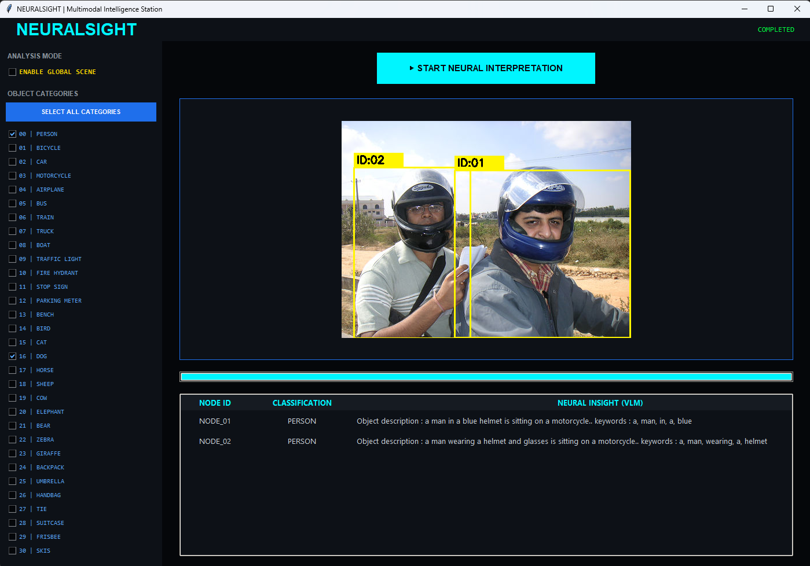
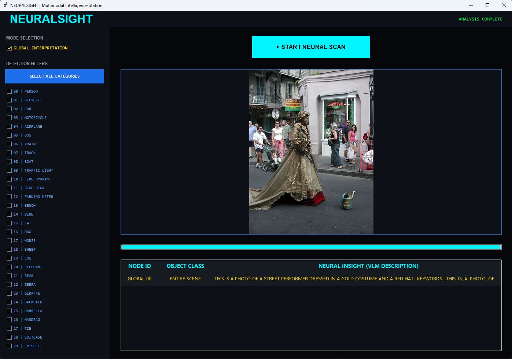

# 👁️ NeuralSight-VLM | Hybrid Neural Intelligence Station




**NeuralSight-VLM** is an advanced Multimodal AI platform that bridges the gap between spatial object detection and semantic language interpretation. By integrating **YOLOv8** for real-time localization and a fine-tuned **BLIP (Vision-Language Model)**, the system provides deep "Neural Insights" instead of just simple labels.

---

## 🚀 Key Features

* **Dual-Stage Inference:** Combines YOLOv8's speed for localization with BLIP's cognitive power for description.
* **Global Scene Interpretation:** Understands the entire context of a photo with a dedicated "Global Mode".
* **Targeted Human Insights:** Specifically fine-tuned on Flickr datasets to describe complex human actions and interactions.
* **Cyber-Themed Dashboard:** A high-tech, dark-mode GUI built with Tkinter for a seamless user experience.
* **CUDA Optimized:** Fully utilizes NVIDIA GPUs for near-instant neural processing.

---

## 🧠 System Architecture

The NeuralSight pipeline functions in two distinct neural stages:

1. **Detection Phase:** The YOLOv8 engine scans the frame, identifying objects and human targets within milliseconds.
2. **Cognitive Phase:** The detected regions (crops) are processed by the **Fine-Tuned BLIP model**, translating visual features into natural language descriptions.


---




## 📊 Dataset & Training

The intelligence of NeuralSight-VLM is derived from rigorous fine-tuning on diverse vision-language datasets:

* **Primary Dataset:** [Flickr30k](https://www.kaggle.com/datasets/hsankesara/flickr-image-dataset) / [Flickr8k](https://www.kaggle.com/datasets/adityajn105/flickr8k).
* **Content:** 31,000+ images (Flickr30k) featuring everyday activities, scenes, and events, each paired with five distinct human-annotated descriptive captions.
* **Fine-Tuning Goal:** The BLIP model was fine-tuned using these datasets to learn the correlation between visual features and natural language, specifically focusing on complex human-object interactions.
* **Custom Formatting:** Data was processed using a specialized SEO-optimized prompt structure to improve the model's descriptive "insight" capabilities.


---

## 📁 Project Structure

```text
NeuralSight-VLM/
├── src/                # Core application source code
│   ├── main_gui.py     # Main Neural Station Interface
│   ├── analyzer.py     # Human-centric action analysis module
│   ├── train.py        # VLM Fine-tuning & Training logic
│   └── utils.py        # Data preprocessing & Vocabulary tools
├── models/             # (Ignored) Model weights (YOLOv8, BLIP)
├── data/               # (Ignored) Training datasets and vocab.json
├── assets/             # UI assets, screenshots, and demonstration media
├── docs/               # Technical documentation
└── requirements.txt    # Project dependencies